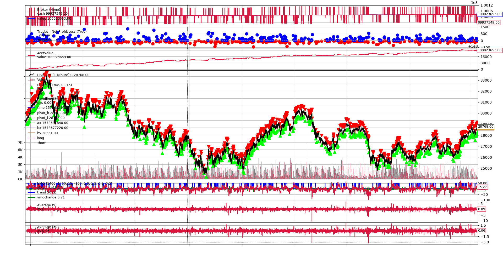

# Trendline-strategy(valid from 2017 to 2019) 

# Description
Strategy logic:
if exit bullish trend or take profit or stop loss
  then close long
if stop loss or take profit
  then close short
if bullish trend(VBMO>threshold) and trendline signal
  then long
else if short signal
  then short

# Reference:
https://www.tradingview.com/script/mpeEgn5J-Trendlines-JD/

https://www.tradingview.com/script/F5BJcmtO-Volatility-Based-Momentum-Oscillator-VBMO/

